


 


 


<a href="https://www.instagram.com/sajidftw/"></a><a href="https://github.com/sajid1108?tab=repositories"></a>

 


<a href="https://github.com/sajid1108/sentinel"></a> <a href="https://github.com/sajid1108/paygate"></a>
<a href="https://github.com/sajid1108/brain-stroke-agent"></a> <a href="https://github.com/sajid1108/Lunar-Navigation-System"></a>
<a href="https://github.com/sajid1108/cricket-score-predictor"></a>

 


 

 

<code>LANGGRAPH</code> · <code>GROQ</code> · <code>XGBOOST</code> · <code>HUGGING FACE</code> · <code>STREAMLIT</code> · <code>POWER BI</code>

 


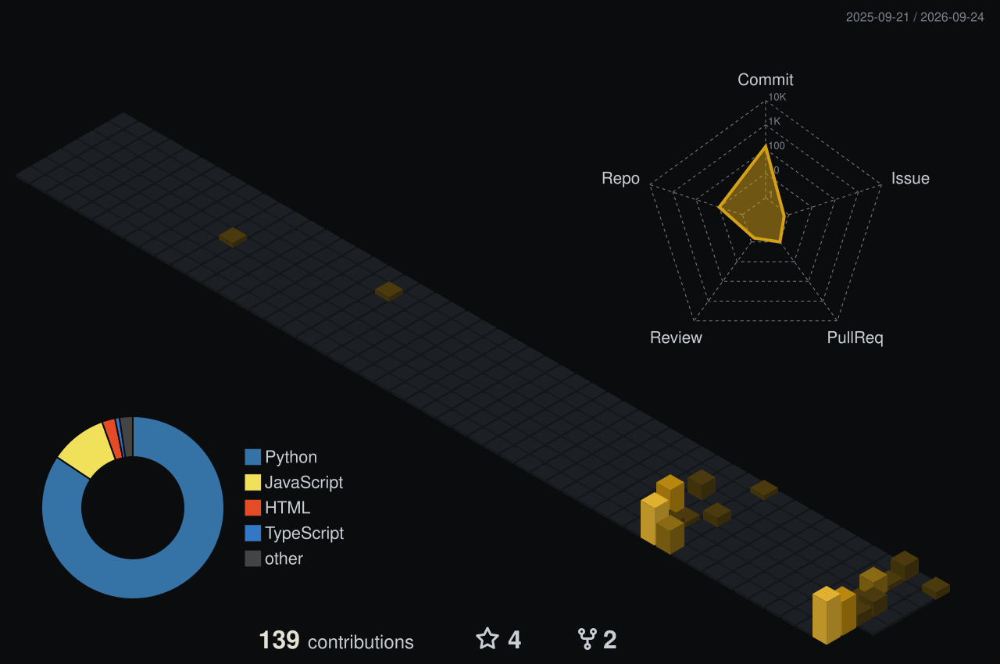

 


